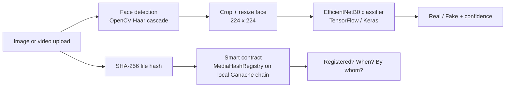

# DeepfakeGuard

[](https://github.com/SamsonSiby5827/deepfakeguard/actions/workflows/tests.yml)

**[Try the live demo](https://huggingface.co/spaces/Samson5827/deepfakeguard-demo)** · [Model on Hugging Face](https://huggingface.co/Samson5827/deepfakeguard-v2)

**Detects deepfake faces in images and videos, and lets you register a file's fingerprint on an Ethereum-style blockchain so it can later be checked for changes.**

BSc (Hons) Computer Science final-year project, University of West London (RAK campus), 2026.

---

## What it does

- **Image check:** upload one or many images. The app finds the face, crops it, and a trained model says *real* or *fake* with a confidence score.
- **Video check:** upload one or many videos. The app samples up to 24 frames, skips frames with no face, blurry faces or tiny faces, and combines the remaining frame predictions into one verdict.
- **Quality warnings:** if no face is found, the face is very small, or the image is blurry, the result is marked as less reliable instead of pretending to be certain.
- **Blockchain verification:** the app computes a SHA-256 fingerprint of the file and can register it on a smart contract. I tested this on a **local Ganache blockchain** (a private practice version of Ethereum that runs on your own computer). Later, the app can check whether the exact same file was registered and when.

## How it works



For videos, frames are sampled evenly across the clip. A video is marked fake if the average fake probability is at least 55% or at least 60% of the valid frames are classified fake.

## Results

Model trained on the **Celeb-DF (v2)** dataset with transfer learning (EfficientNetB0). The data was split **by video, not by frame** (70/15/15), so frames from the same video never appear in both training and testing. This prevents the model from "memorising" people and inflating the score.

| Model version | Input | Held-out test accuracy | Fake recall |
|---|---|---|---|
| V1 | Full frame | 64% | 0.53 |
| **V2 (used in the app)** | **Face crop** | **80%** | **0.78** |

V2 was evaluated on 2,416 held-out test images.

**What I learned along the way**

- Cropping to the face, instead of using the whole frame, was the single biggest improvement (64% → 80%).
- An experimental V3 model scored **88% offline** but labelled more than half of fake images as real when tested live in the app, so I **rejected it** and kept V2. Offline scores are not the whole story.
- In final live testing of the app, it classified 37 of 40 images and 17 of 19 analysed videos correctly (a small, hand-picked test set, so treat this as a sanity check, not a benchmark).

## Tech stack

| Area | Tools |
|---|---|
| Machine learning | TensorFlow / Keras (EfficientNetB0 transfer learning), NumPy |
| Computer vision | OpenCV (face detection, cropping, blur check, video frame sampling) |
| Web app | Flask, HTML/CSS (Jinja templates) |
| Blockchain | Solidity smart contract, Web3.py, Ganache (local Ethereum blockchain) |
| Other | SHA-256 hashing, python-dotenv |

## Project structure

```
deepfakeguard/
├── app.py                     # Flask web app: routes for images, videos, batches, blockchain
├── api/
│   ├── main.py                # FastAPI service (v2): /, /health, /predict/image
│   └── static/index.html      # Upload page used by the live demo
├── tests/
│   └── test_api.py            # Automated API tests (run without the real model)
├── src/
│   ├── ml/
│   │   ├── deepfake_inference.py   # Face crop + model prediction for one image
│   │   └── video_inference.py      # Frame sampling, quality filters, video verdict
│   ├── data/                       # Celeb-DF preparation and frame extraction
│   ├── blockchain/
│   │   ├── contract.sol            # MediaHashRegistry smart contract
│   │   ├── contract_abi.json
│   │   └── web3_client.py          # Register / look up file hashes
│   └── utils/hashing.py            # SHA-256 file fingerprint
├── scripts/                   # Dataset preparation scripts
├── configs/                   # Dataset split and frame extraction settings
├── templates/                 # Web pages
├── requirements.txt
├── Dockerfile                 # Container recipe for the API
├── requirements-docker.txt    # Pinned libraries for the container
└── .env.example               # Blockchain settings template (no real keys)
```

## Run it locally

> **Model weights are not stored in this repository.** They are published on Hugging Face at [Samson5827/deepfakeguard-v2](https://huggingface.co/Samson5827/deepfakeguard-v2) (research and non-commercial use only). The API and Docker image download them automatically. The original Flask app (`app.py`) expects them in `models/image_classifier_v2/`, so download the two files from the model page into that folder first.

Requires **Python 3.10 or newer**.

```bash
git clone https://github.com/SamsonSiby5827/deepfakeguard.git
cd deepfakeguard
python -m venv venv
venv\Scripts\activate          # Windows  (macOS/Linux: source venv/bin/activate)
pip install -r requirements.txt
python app.py
```

Then open the address shown in the terminal (usually http://127.0.0.1:5000).

**Blockchain is optional.** To enable it, start Ganache, deploy `src/blockchain/contract.sol` to it, then copy `.env.example` to `.env` and fill in the Ganache RPC URL, the deployed contract address and the private key of one of Ganache's **test accounts**. The client uses standard Web3.py, so it can also point at a public testnet such as Sepolia by changing `.env`. Never commit `.env`.

### Run the API (v2)

The same image model is also available as a JSON API built with FastAPI.

```bash
pip install -r requirements.txt
python -m uvicorn api.main:app
```

Open http://127.0.0.1:8000/docs to try it in the browser.

| Endpoint | What it does |
|---|---|
| `GET /` | Simple upload page for people |
| `GET /health` | Shows whether the server is up, the model loaded and where it came from |
| `POST /predict/image` | Upload a JPG, PNG or WEBP (max 10 MB) and get `label`, `confidence`, `probabilities`, face box, quality scores and warnings |

Example response:

```json
{
  "label": "fake",
  "confidence": 0.8751,
  "probabilities": {"fake": 0.8751, "real": 0.1249},
  "face_detected": true,
  "face_box": [63, 13, 91, 91],
  "blur_score": 100.67,
  "face_area_ratio": 0.165,
  "warnings": []
}
```

### Run the API with Docker

Docker packs the API, its exact library versions and the model into one container, so it runs the same on any machine.

```bash
docker build -t deepfakeguard-api .
docker run --rm -p 8000:8000 deepfakeguard-api
```

Then open http://127.0.0.1:8000 for the upload page or http://127.0.0.1:8000/docs for the API. On first start the container downloads the model from Hugging Face. The image is based on `python:3.12-slim`, runs as a non-root user, never includes `.env` or dataset files (see `.dockerignore`), and has a built-in health check on `/health`.

In testing, the container returned exactly the same predictions as the app running directly on Windows (for example fake 0.8751 and real 0.9922 on the same two test images).

### Run the tests

```bash
pip install -r requirements-dev.txt
python -m pytest
```

The tests use a fake model, so they run in about a second without TensorFlow or the model weights.

## Limitations

- Trained on one dataset (Celeb-DF). Accuracy on other deepfake methods or real-world social media videos is likely lower.
- Face detection uses a simple Haar cascade, which misses side-on or partly covered faces.
- Batch results are kept in memory, so they disappear when the app restarts.
- Blockchain records were tested on a local Ganache chain, so they are not publicly verifiable yet.

## Roadmap

- [x] Publish model weights and a model card on Hugging Face
- [x] Live demo on Hugging Face Spaces
- [x] FastAPI service for image checks (`api/`)
- [x] Automated API tests with pytest
- [x] Package with Docker
- [x] Run the tests automatically on every push (GitHub Actions)
- [ ] Add video checks to the API
- [ ] Deploy the smart contract to a public testnet (Sepolia) so records can be checked by anyone

## Dataset and ethics

The Celeb-DF dataset is used for research only and is **not redistributed** in this repository. No dataset images or videos are included. This tool gives a probability, not proof: it should support human judgement, not replace it.

## Author

**Samson Siby** · [LinkedIn](https://www.linkedin.com/in/samson-siby-046219295) · [GitHub](https://github.com/SamsonSiby5827)
